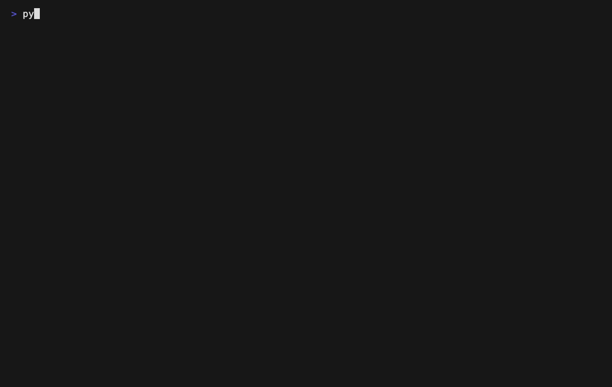

# Pythonlings

[](https://pypi.org/project/pythonlings/)
[](https://pypi.org/project/pythonlings/)
[](https://github.com/abhiksark/pythonlings/actions/workflows/ci.yml)
[](https://pypi.org/project/pythonlings/)
[](LICENSE)

Documentation: [pythonlings.abhik.ai](https://pythonlings.abhik.ai/)

**Rustlings for Python — learn by fixing 292 tiny broken programs in your terminal.**

Pythonlings helps you learn Python by fixing small broken programs and watching
checks rerun as you type. It is built for beginner Python practice, coding
practice, and self-paced Python tutorial workflows: 292 exercises, hidden
pytest-style checks, a live Textual editor, progressive hints, and bundled
Python documentation snippets so learners can work without leaving the terminal.

**Try it in 10 seconds** — zero install, needs [Python 3.9+](https://www.python.org/downloads/)
and [uv](https://docs.astral.sh/uv/):

```bash
uvx pythonlings init --path ./learn-python
cd learn-python && uvx pythonlings
```

How it works: **edit** the broken exercise in the built-in editor → checks
rerun as you type and advance you to the next one. That's the whole loop.

Status: `v0.3.0`, alpha — published on PyPI as `pythonlings`.


## Highlights

- 292 Python exercises across 31 topics, from variables through async.
- Rustlings-inspired learn-by-doing flow for Python coding practice.
- Live in-terminal editor with automatic checks after edits.
- Topic picker with progress, resume state, reset, hints, and one-shot CLI runs.
- `F5` opens a local Python reference window; `O` opens the official docs page.
- Bundled docs are generated from the official Python documentation for offline use.

## Who It Is For

- Python beginners who want short, focused practice instead of passive reading.
- Rustlings users who want the same fix-and-verify loop for Python.
- Learners who prefer working in a terminal with local docs close to the code.
- Contributors interested in building curriculum, checks, and terminal UX.

## What Happens When You Run It

1. `pythonlings init` creates a self-contained learner workspace with exercises,
   hidden checks, local docs, and original snapshots for reset.
2. `pythonlings` opens the first pending exercise in the terminal UI.
3. You edit the broken code, remove `# I AM NOT DONE`, and checks rerun as you
   work.
4. Passing checks mark the exercise complete and move progress forward. `F4`
   opens the topic picker, `F5` opens local docs, and `Esc` quits main screens.

## Install

Pythonlings is on PyPI as **`pythonlings`** (it installs the `pythonlings`
command). You need [Python 3.9+](https://www.python.org/downloads/).

Recommended — install it isolated, like any CLI app:

```bash
pipx install pythonlings
# or
uv tool install pythonlings
```

Or run it with no install at all:

```bash
uvx pythonlings
```

Or plain pip (use a virtual environment):

```bash
pip install pythonlings
```

> Pythonlings was previously published as `python-learnings`. The package
> `pylings` on PyPI is an unrelated project — install `pythonlings`.

For the latest development build from `main`:

```bash
pipx install --force "git+https://github.com/abhiksark/pythonlings.git"
```

Create a learner workspace before starting:

```bash
pythonlings init --path ~/pythonlings-workspace
cd ~/pythonlings-workspace
pythonlings
```

For local development:

```bash
git clone git@github.com:abhiksark/pythonlings.git
cd pythonlings
pip install -e ".[dev]"
```

## Quick Start

```bash
pythonlings init --path ./learn-python     # create a self-contained workspace
cd learn-python
pythonlings                              # open the TUI on the first pending exercise
pythonlings topics                       # open the topic picker
pythonlings list                         # show topic progress
pythonlings hint variables1              # print a hint and docs link
pythonlings run variables1               # run one exercise check
pythonlings dry-run variables1           # run one exercise non-interactively
pythonlings reset variables1 --yes       # restore an exercise from its original
pythonlings update                       # refresh checks/docs after upgrading pythonlings
```

Each exercise contains a `# I AM NOT DONE` marker. Fix the code, remove the
marker, and let the live check advance you to the next exercise.

## Demo



The demo is generated from [docs/demo.tape](docs/demo.tape). See
[docs/DEMO_GIF.md](docs/DEMO_GIF.md) to regenerate it with
[VHS](https://github.com/charmbracelet/vhs). It covers the first-run flow,
progress listing, hints, the coding screen, local docs, topic picker, and quit
path.

## Interface


| Key | Action |
|---|---|
| `F1` | Toggle hint |
| `F2` | Reset the current exercise |
| `F3` | Toggle the exercise list |
| `F4` | Return to the topic picker |
| `F5` | Show the local Python reference |
| `O` | Open official docs from the reference window |
| `Esc` | Close docs, or quit from main screens |
| `Ctrl+Q` | Quit |


## Project Layout

```text
pythonlings/                 # application package
  core/                  # manifest, state, runner, reset, docs loading
  screens/               # Textual screens
  widgets/               # reusable TUI widgets
  docs/                  # bundled Python documentation snippets
pythonlings/curriculum/      # packaged copy in built wheels
exercises/<topic>/       # learner-editable exercise files
checks/<topic>/          # hidden assertions for each exercise
tests/                   # unit, integration, and TUI tests
scripts/fetch_python_docs.py
info.toml                # curriculum order, hints, and docs URLs
```

Regenerate the local reference snippets with:

```bash
python scripts/fetch_python_docs.py
```

## Development

```bash
pip install -e ".[dev]"
python -m pytest -q
pythonlings --root tests/fixtures/passing_curriculum verify
```

When adding curriculum, update `exercises/`, `checks/`, and `info.toml`
together. Keep exercise and check filenames mirrored, for example
`exercises/lists/lists3.py` and `checks/lists/lists3.py`.

## Contributing

Pythonlings is actively developed and welcomes contributors — beginners included.
The current focus is the [0.3.0 roadmap](docs/roadmap/0.3.0.md) (wider adoption),
and every roadmap issue is written to be picked up cold. Start with a
[`good first issue`](https://github.com/abhiksark/pythonlings/issues?q=is%3Aopen+label%3A%22good+first+issue%22),
comment to claim it, and see [CONTRIBUTING.md](CONTRIBUTING.md).

## Release Flow

Pythonlings uses Semantic Versioning:

- `MAJOR`: incompatible curriculum or CLI changes.
- `MINOR`: new topics, exercises, TUI features, or docs workflows.
- `PATCH`: fixes, copy edits, and compatible test or packaging updates.

Branch flow is feature-first:

```text
feature/<name> -> dev -> main -> vMAJOR.MINOR.PATCH
```

Feature branches are merged into `dev`. A verified `dev` branch is then merged
into `main` and tagged with an annotated release tag such as `v0.1.0`.
See [RELEASE.md](RELEASE.md) for the release checklist.

## Attribution

Pythonlings is inspired by [rustlings](https://github.com/rust-lang/rustlings).
Bundled reference snippets are generated from the official Python documentation.
See [pythonlings/docs/NOTICE.md](pythonlings/docs/NOTICE.md) for Python documentation
licensing details.

## License

MIT. See [LICENSE](LICENSE).
